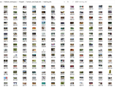
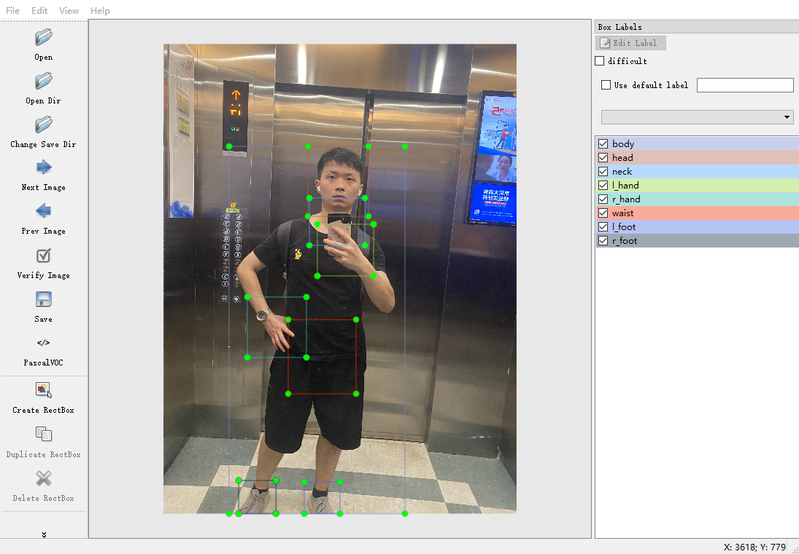
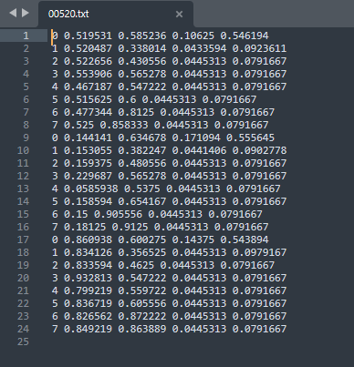

# DTS数据集制作校验相关说明


**本次训练当中的所有数据集均为自己制作，主要的人物同学和自己，为了保证隐私安全。目前数据集并不公开,用户可以选取视频数据进行自行制作（推荐使用labelimg）**

<div align="center">
    <a href="">
          
    </a>
</div>


## 数据的标注和说明

* 采用**labelimg**对图片进行标注，保存数据为xml格式

<div align="center">
    <a href="">
          
    </a>
</div>


**xml数据格式说明**

* 使用labelimg对图片进行标注，可以从xml文件当中获取数据的文件夹、文件名、路径、来源、格式、目标对象的类别，位置等信息。

```xml
<annotation>
	<folder>xml_dts</folder>
	<filename>00120.JPG</filename>
	<path>E:\WorkSpace\Matlab_Workspace\Hispark\xml_dts\00120.JPG</path>
	<source>
		<database>Unknown</database>
	</source>
	<size>
		<width>3024</width>
		<height>4032</height>
		<depth>3</depth>
	</size>
	<segmented>0</segmented>
	<object>
		<name>body</name>
		<pose>Unspecified</pose>
		<truncated>1</truncated>
		<difficult>0</difficult>
		<bndbox>
			<xmin>562</xmin>
			<ymin>879</ymin>
			<xmax>2068</xmax>
			<ymax>4032</ymax>
		</bndbox>
	</object>
	  
    ......
    
	<object>
		<name>r_foot</name>
		<pose>Unspecified</pose>
		<truncated>1</truncated>
		<difficult>0</difficult>
		<bndbox>
			<xmin>644</xmin>
			<ymin>3747</ymin>
			<xmax>963</xmax>
			<ymax>4032</ymax>
		</bndbox>
	</object>
</annotation>

```

**txt数据格式说明**

darknet 训练需要.txt文件（label的格式）

* **darknet 标注信息数据格式：**

  **Classes id	center_x	center_y 		w 		h**

  **数据格式说明**

  ​		 Class id ： 表示标注框的类别，从0开始计算，当前有8类物体，故Classes id的范围为0~7；

  ​		 center_x:	表示归一化后的物体框中心点坐标的 X 值。归一化坐标 = 实际坐标 / 整个图片宽；

  ​		 center_y:	表示归一化后的物体框中心点坐标的 Y 值。归一化坐标 = 实际坐标 / 整个图片高；

  ​		 w			:	表示归一化后的物体框的宽。归一化长度 = 实际长度 / 整个图片宽；

  ​		 h			 :	表示归一化后的物体框的高。归一化长度 = 实际长度 /整个图片高。

  

  <div align="center">
      <a href="">
            
      </a>
  </div>

## 数据格式的转换

* 采用matlab脚本对xml的数据标注进行转换；

* 具体转换脚本参考此文件夹下面的xml_2_txt.mlx脚本进行转换，其中xml_dts路径包含一个待转换的xml文件示例；

* 使用matlab打开xml_2_txt.mlx文件，并将工作路径转到该文件所在的路径下。

  ```matlab
  cd('E:\3.WorkSpace\Matlab_workspace\Hispark\');
  
  ```

  

<div align="center">
    <a href="">
          
    </a>
</div>


```matlab
width = 3024
height = 4032
thiselement_id = 0
thiselement_xmin = 562
thiselement_xmax = 2068
thiselement_ymin = 879
thiselement_ymax = 4032

......

thiselement_id = 7
thiselement_xmin = 644
thiselement_xmax = 963
thiselement_ymin = 3747
thiselement_ymax = 4032
Array_bnorm = 8×5    
         0    0.4349    0.6090    0.4980    0.7820
    1.0000    0.4949    0.2924    0.1716    0.1488
    2.0000    0.4919    0.3783    0.1571    0.1009
    3.0000    0.5155    0.4387    0.1594    0.1101
    4.0000    0.3211    0.6031    0.1673    0.1287
    5.0000    0.4494    0.6658    0.1925    0.1580
    6.0000    0.4494    0.9663    0.1012    0.0675
    7.0000    0.2657    0.9647    0.1055    0.0707


```


## 数据校验

* 采用matlab脚本对转换后的数据进行绘制在原图上面进行核验；
* Training_Check.m完成对训练集数据的验证；
* Validation_Check.m完成对验证集数据的验证。
