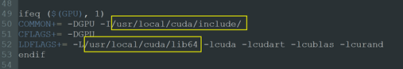
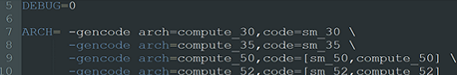
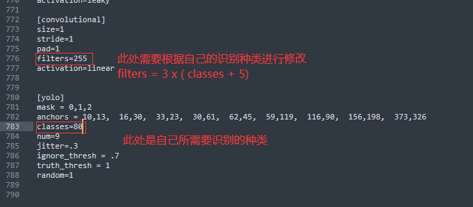
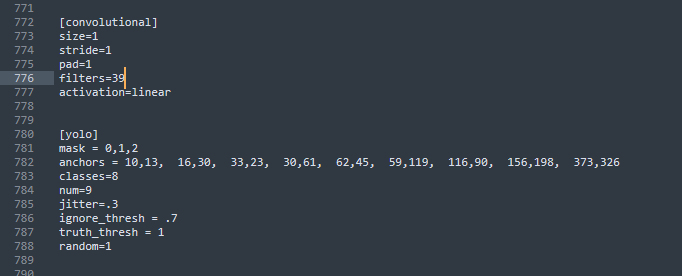
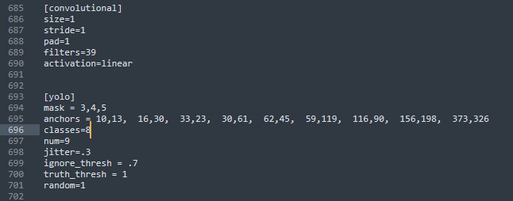
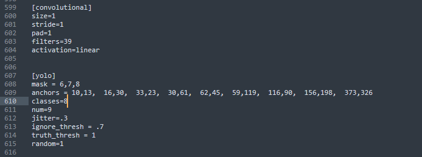
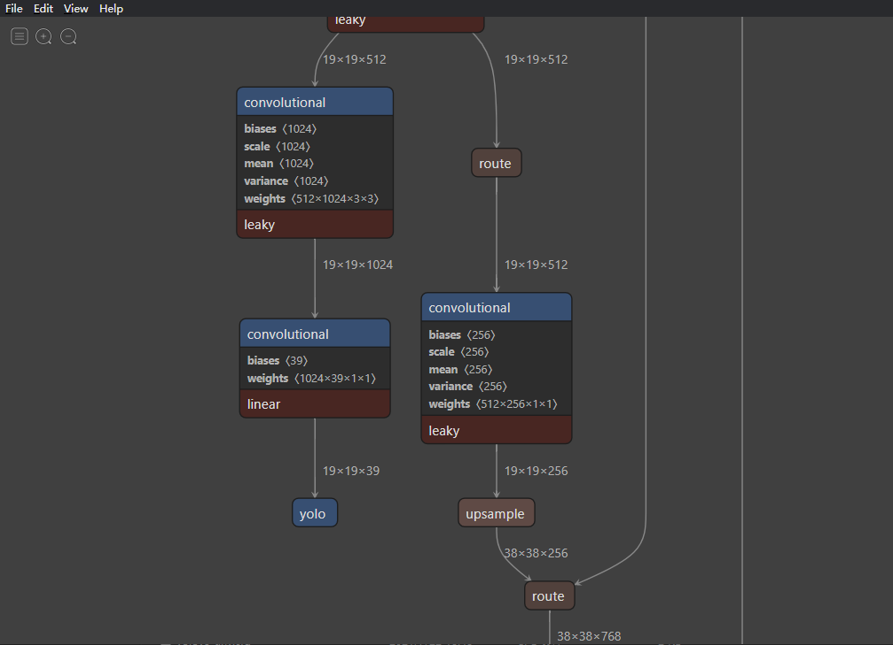
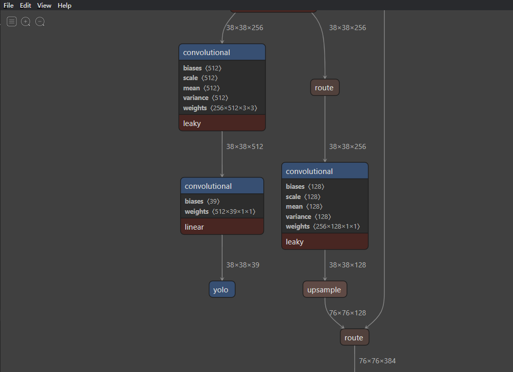
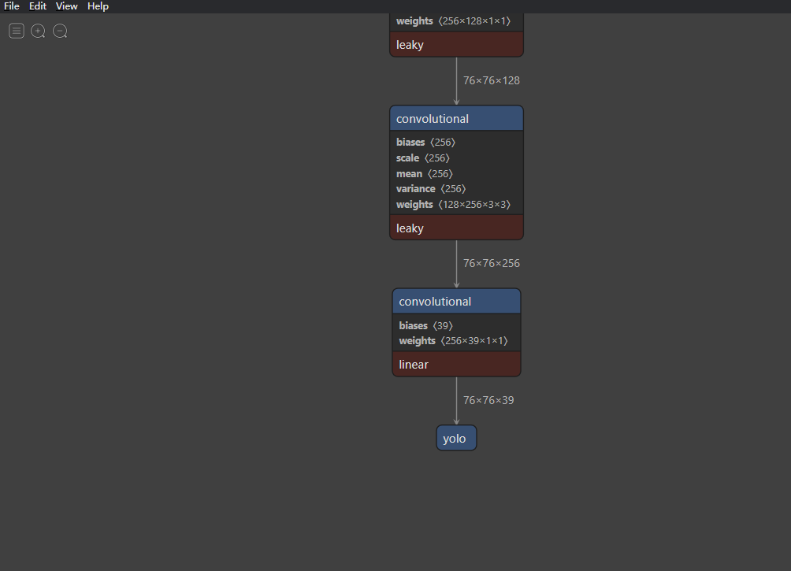
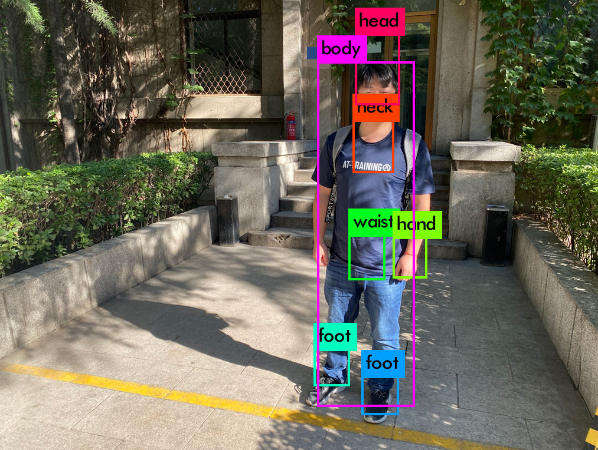

# darknet-mixpose训练脚本使用方法（含测试方法）

此处采用YOLO v3为检测识别的骨干网络，采用的训练框架为darknet。


## 安装darknet


* 下载库文件进行修改（直接使用本目录下面已经修改好的文件也可）

```shell
git clone https://github.com/pjreddie/darknet
cd darknet
```

* 根据训练平台修改Makefile文件

  需要自行根据本地cuda和cudnn安装位置修改Makfile文件，然后编译darknet。

  <div align="center">
      <a href="">
            
      </a>
  </div>
  
  


  若报错，则需要根据自己本地显卡型号修改ARCH。

  <div align="center">
      <a href="">
            
      </a>
  </div>


  若报错，则需要根据自己本地显卡型号修改ARCH。


## 修改cfg/yolov3.cfg

在这一部分主要需要修改的地方有三部分，分别对应的yolo v3的三个输出地方，即对应的大中小三类物体的。

<div align="center">
    <a href="">
          
    </a>
</div>


* 首先先进行输出语义最高的y1部分的修改，这一部分需要修改的地方有两个地方，分别为识别的种类classes和最后的一个通道滤波器个数filters

<div align="center">
    <a href="">
          
    </a>
</div>


​	在本工程当中所需要识别的物体种类为8类物体，所以进行了如下图所示的修改。

<div align="center">
    <a href="">
        
    </a>
</div>

* 同理我们对y2和y3进行修改

<div align="center">
    <a href="">
        
    </a>
</div>


<div align="center">
    <a href="">
        
    </a>
</div>

## 查看修改的网络模型

<div align="center">
    <a href="">
         
    </a>
</div>

<div align="center">
    <a href="">
         
    </a>
</div>

<div align="center">
    <a href="">
         
    </a>
</div>


## 训练自己的模型

在完成以上的修改后，需要进行源码的编译，即make

```shell
./darknet detector train mixpose.data cfg/yolov3.cfg
```

* 设置自动保存脚本

  ```shell
  #! /bin/bash
  #Weights auto save script
  while true
  do
  	cp -rf /home/bing/work/darknet-mixpose/backup/*	/mnt/hgfs/bing-mixpose-autosave/
  	sleep 1m
  done
  ```

  

<div align="center">
    <a href="">
        
    </a>
</div>


## 测试训练权重

---


此部分是对训练完成后的权重文件在pc上进行测试

测试脚本如下

```shell
./darknet detect ./cfg/yolov3.cfg ./yolov3_210000.weights ./0.png -thresh 0.6
```


<div align="center">
    <a href="">
         
    </a>
</div>


