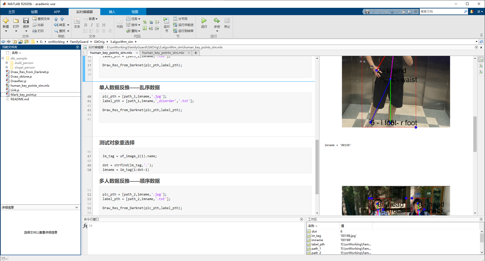
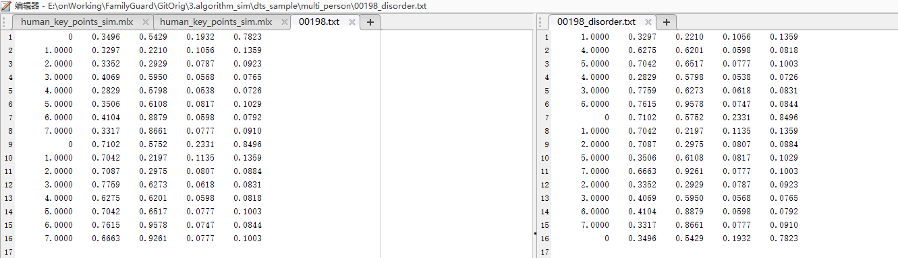
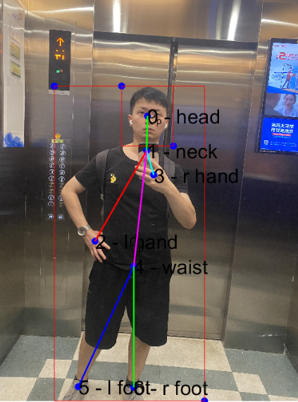
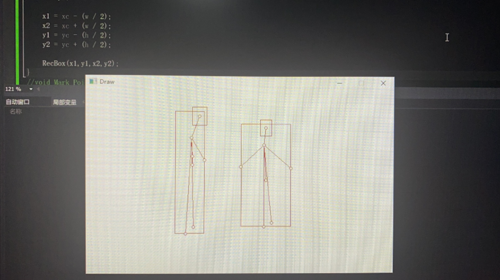

# Algorithm Sim

此处采用matlab对算法模型进行开发仿真。

## 人体关键点重组

* 采用**PAFs**的思想对提取出来的各个关键点进行重组；
* 对乱序的输入结果进行仿真；
* 对缺少个别信息点进行算法补全。

<div align="center">
    
    <br>
    <a>Matlab-Sim </a>
</div>

<div align="center">
    
    <br>
    <a>order data(left) disorder(right) </a>
</div>


* 重点代码说明

```matlab
pic_pth = [path_1,imname,'.jpg'];
label_pth = [path_1,imname,'.txt'];
%@Brief: 从数据当中重新对每个人体关键点进行重组
%
%@Param: pic_pth  -------> picture path
%		 label_pth-------> label path

Draw_Res_from_Darknet(pic_pth,label_pth);
```


### 有序数据测试


<div align="center">
    
    
    <br>
    <sup>Singal-person(left) Multi-person(right) <a href="http://www.xidianfamilyguard.com" target="_blank">Author:bingxie</a></sup>
</div>


### 无序数据测试

<div align="center">
    
    
    <br>
    <sup>Singal-person(left) Multi-person(right) <a href="http://www.xidianfamilyguard.com" target="_blank">Author:bingxie</a></sup>
</div>


## 驱动函数的仿真

采用C语言进行结果绘制函数的开发，用于在板端实现推理结果的展示。


<div align="center">
    
</div>
