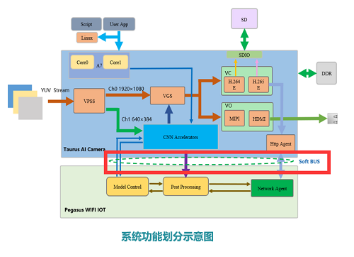
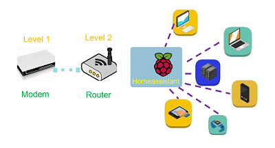
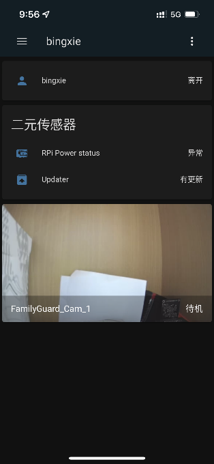

# Soft-BUS 软总线

## V1.0版本

此处为自定义的通信协议，目的为将Taurus板端推理的结果传回到Pegasus端，同时将Taurus本地所保存的视频队列传输至服务器云端，从而实现在手机网页端的视频数据远程”实时“点播，总体的实现框架如下图所示。

    
     
    FamilyGuard system arch <a href="http://www.xidianfamilyguard.com" target="_blank">Author:bingxie</a>

具体协议的实现细节用户可自行进行数据帧的定义，解析时只需根据定义的格式依次获取数据。

## V2.0版本

此版本当中，引入了**Homeassistant**作为智能家庭的传输枢纽

* 额外的APP安装会破坏整体的体验；

* 可以轻松的与其它智能家居产品进行联动；

* Homeassistant的端口通过路由器转发，路由器的端口通过光猫转发。

      
       
      Homeassistant architecture <a href="http://www.xidianfamilyguard.com" target="_blank">Author:bingxie</a>

**手机端访问效果**

      
       
      Homeassistant <a href="http://www.xidianfamilyguard.com" target="_blank">Author:bingxie</a>
  

