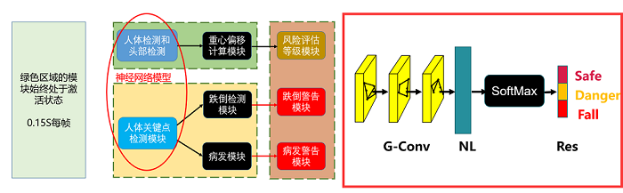
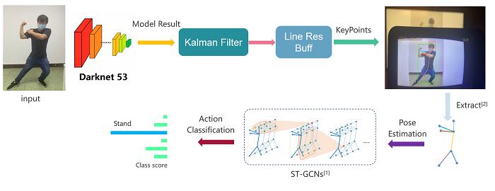
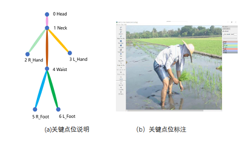

# Post Processing

* 此部分包含Pegasus端的处理程序和必要的算法仿真思路。

## 整体框架

主要接收来自于Taurus板端的推理计算结果，并根据各个关节的相对位置坐标进行对应的评估,大致思路如下：

**粗粒度识别思路**

* 重心的剧烈变化意味着大幅度的动作;
* 头部的加速度和身体的宽长比在一定程度上反应了人体的活动姿态。

**粗粒度识别思路**

* 不同人体姿态中各个关节的相对位置的时空分布会呈现不同的分布规律；
* 使用Matlab的信号处理工具箱对不同姿态动作的关节时空坐标进行分析，可以得出分布规律；
* V1版本中仅采用了传统的数字信号处理的思路进行姿态的判断，V2版本中则才已经ST-GCN对其进行更加细致的鉴定。

    
     
    Post processing arch <a href="http://www.xidianfamilyguard.com" target="_blank">Author:bingxie</a>

## 算法仿真

此部分仅是对原始论文当中的算法进行了复现，并将其进行修改以适应本项目的需求。

    
     
    Post processing alg <a href="http://www.xidianfamilyguard.com" target="_blank">Author:bingxie</a>

* 在本项目当中的关键的信息如图所示

 

    
     
    Post processing alg <a href="http://www.xidianfamilyguard.com" target="_blank">Author:bingxie</a>

## 参考文献

[1]Sijie Yan,Yuanjun Xiong,Dahua Lin. Spatial Temporal Graph Convolutional Networks for Skeleton-Based Action Recognition [c]. Proceedings of The 2018 IEEE Conference on Computer Vision and Pattern Recognition

[2]CAO Z, SIMON T, WEI S E, et al. Realtime Multi-Person 2D Pose Estimation using Part Affinity Fields[c]. Proceedings of The 2017 IEEE Conference on Computer Vision and Pattern Recognition

