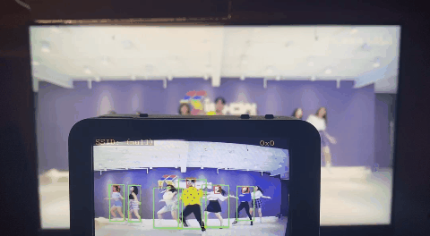
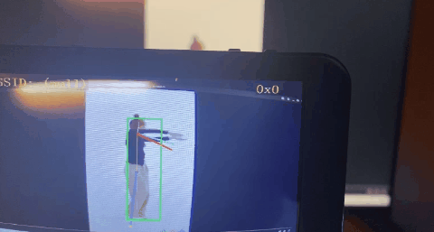
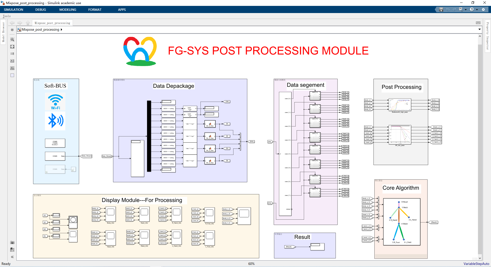
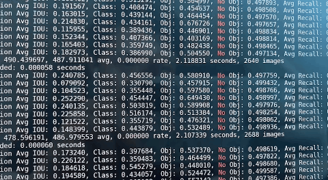

# Family Guard

    

|  **Build Type**  | `Linux` | `MacOS` | `Windows` |
| :--------------: | :-----: | :-----: | :-------: |
| **Build Status** | passed  | unknown |  passed   |

​	[**FamilyGuard**](http:www.xidianfamilyguard.com)是一个部署在嵌入式平台的智能家庭系统，可以帮助我们快速的了解家庭状况，并针对一些异常行为做出及时的应对，避免一些意外事件的发生。所有模型均在边缘设备进行本地推理，因此在数据隐私安全上面可以起到很好的保护。

​	该产品的核心功能是[检测人群行为](#结果测试)，所以不仅可应用于监测家庭，还可以用 在其他需要对人群行为进行检测的地方。比如统计教室里学生的专注力，监测社 区街道和养老院房间走廊等地方的异常行为。

    
     
    Tesing Mixpose <a href="http://www.xidianfamilyguard.com" target="_blank">Author:bingxie</a>

## 目录

1. [结果测试](#结果测试)

2. [文件说明](#文件说明)

3. [特性说明](#特性说明)

4. [部署流程](#部署流程)

5. [问题反馈](#问题反馈)

6. [隐私权限](#隐私权限)

   

## 结果测试

### Human Rec & Head—2D

    
    
    
     
    Two-person(left) Four-person(center) Multi-person(right) <a href="http://www.xidianfamilyguard.com" target="_blank">Author:bingxie</a>

### Mixpose Short —2D

    
     
    Tesing Mixpose Singal-person <a href="http://www.xidianfamilyguard.com" target="_blank">Author:bingxie</a>

## 文件说明

| **文件名称**          |                    `文件描述`                    |   `其它说明`   |
| :-------------------- | :----------------------------------------------: | :------------: |
| **.github**           |    媒体插图文件夹，主要保存README文件中的插图    |      .png      |
| **0.dts**             |  模型训练数据集，主要为模型训练数据集的制作脚本  |       /        |
| **1.traing_script**   |  模型训练脚本文件，包含多个模型所采用的训练框架  |       .c       |
| **2.model_file**      |  板端部署的模型文件，主要为插件和网络的量化文件  |   .wk .plugs   |
| **3.algorithm_sim**   | 相关的算法仿真文件,包括c语言的驱动、Simulink仿真 |   .c .m .slx   |
| **4.soft_bus**        |    软总线相关协议的说明，API接口以及代码示例     |     .c .m      |
| **5.post_processing** |  后处理算法的实现，即软件算法在Pegasus端的部署   |       .c       |
| **6.hci_if**          |   人机交互程序，此部分为微信小程序和网页客服端   | .wxml... .html |

## 特性说明

* 采用分层级多段式神经网络进行姿态估计，可以保证帧率和准确性；
* 后处理算法为软件实现，部署于Pegasus端，可实现对NNIE的硬件输出结果进行处理；
* 采用Simulink对后处理算法模型进行建模仿真。

    
     
    Simulink Post processing <a href="http://www.xidianfamilyguard.com" target="_blank">Author:bingxie</a>

## 部署流程

    

    

## 问题反馈

* 邮箱：binxe@stu.xidian.edu.cn

## 隐私权限

* 此次模型的训练数据集为同学和自己的照片组成，为了保证隐私，暂不进行公开，仅提供数据集的制作教程，数据核验和转换的脚本；
* 此次工程仅供个人学习所用。

